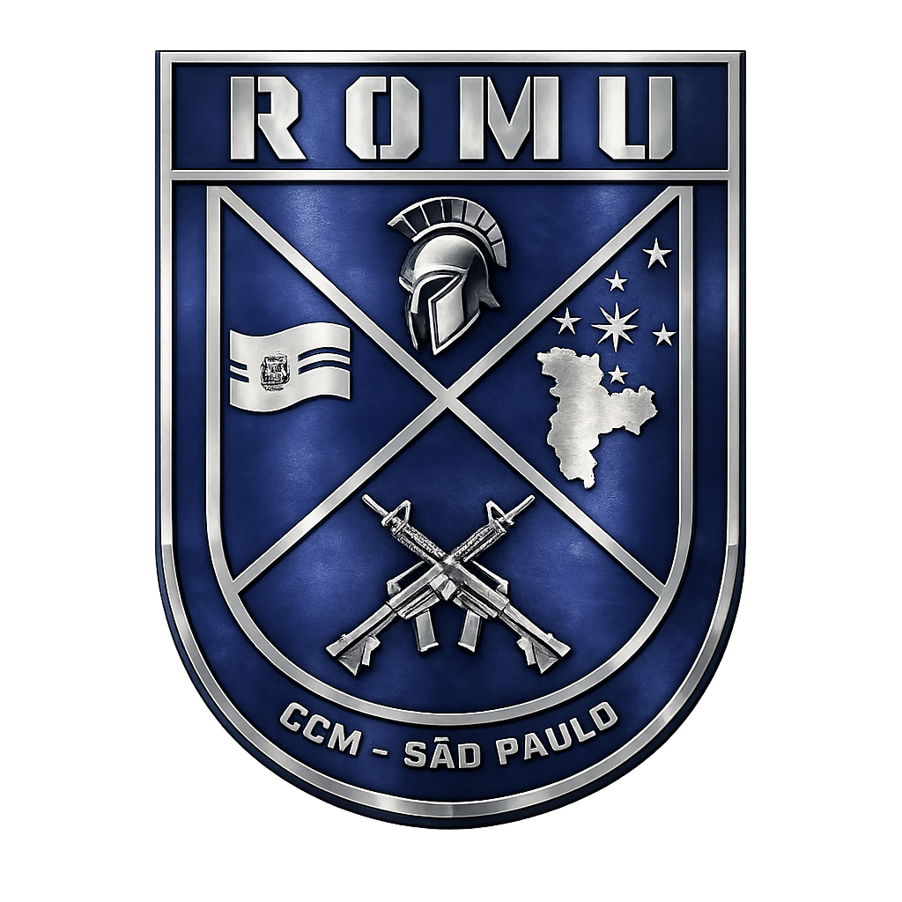

<p align="center">
  
</p>

<h1 align="center">Painel GCM Metropolitana</h1>

<p align="center">
  <strong>Sistema de gestão operacional para Guarda Civil Municipal (Roleplay)</strong>
</p>

<p align="center">
  
  
  
  
  
</p>

---

## 📋 Sobre o Projeto

O **Painel GCM Metropolitana** é um sistema de comando e controle projetado para gerenciar operações, efetivo e comunicação interna da corporação. Desenvolvido com foco em **hierarquia**, **controle de acesso granular por patente** e **experiência limpa e moderna**.

---

## 🚀 Deploy na Vercel (Frontend)

Este projeto foi reestruturado para hospedar o **Frontend** e o **Backend** separadamente na Vercel, melhorando a performance e manutenção. **Este guia é focado no Frontend.**

### 1. Criar projeto na Vercel
1. Vá em **Add New > Project** no painel da Vercel.
2. Importe o repositório do seu painel.
3. O *Root Directory* deve continuar como `./` (raiz).
4. O *Framework Preset* deve ser detectado automaticamente como **Vite**.

### 2. Variáveis de Ambiente
Vá em **Environment Variables** e adicione a variável que conecta o front ao back:
- `VITE_API_URL` = `https://<URL_DO_SEU_BACKEND_NA_VERCEL>.vercel.app`

*(Você deve subir o backend primeiro, copiar a URL dele, e colocar aqui. Se for usar localmente, não precisa preencher).*

### 3. Deploy
Clique em Deploy. A Vercel vai compilar o app React e deixar a interface no ar.

---

## 🎨 Design Atualizado

- **Light mode clean** com paleta clara (`slate-50`, fundos brancos com blur) e acentos na cor oficial azul (`sky-500`)
- **Glassmorphism** e micro-animações em toda a interface
- **Tipografia**: Inter + Outfit (Google Fonts)
- **Brasões e Cargos da GCM**: Atualizado da base militar padrão para a hierarquia da Guarda Civil (Inspetor Superintendente, Subinspetor, Classe Distinta, etc)

---

## 📁 Estrutura do Projeto (Front)

```
├── public/
│   └── logo.png          # Logo da corporação (ícone da aba)
├── src/
│   ├── assets/           # Imagens e logos (logo.png)
│   ├── components/       # Componentes visuais
│   ├── context/          # Autenticação global e permissões
│   ├── pages/            # Telas do sistema
│   ├── App.tsx           # Roteamento
│   └── main.tsx          # Ponto de entrada
├── .env                  # Variável do Frontend (VITE_API_URL)
└── vite.config.ts        # Config do Vite (contém proxy para dev)
```

---

<p align="center">
  <sub>Desenvolvido com ☕ para a <strong>Guarda Civil Municipal</strong></sub>
</p>
